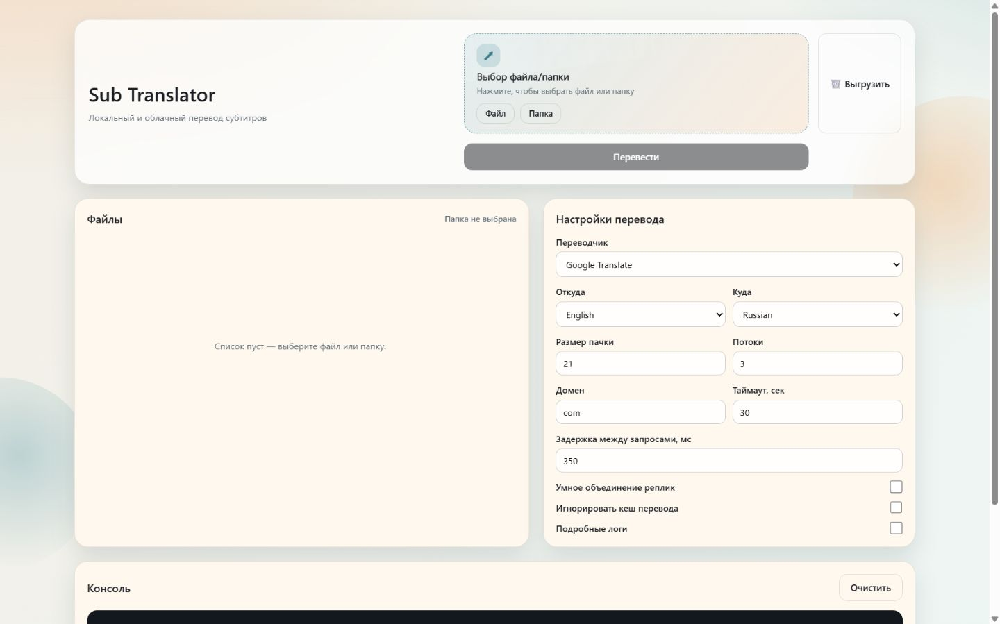

# sub-translator-py

Локальное приложение для пакетного перевода субтитров ASS, SRT и WebVTT. Командный и
веб-интерфейсы используют один прикладной конвейер: разбирают исходный формат, переводят только
текст реплик, проверяют мощность ответа, восстанавливают исходную структуру и атомарно публикуют
результат в UTF-8 без BOM.

Проект поддерживает сетевые переводчики Google Translate и OpenAI, а также четыре локальных
профиля: NLLB 600M, TranslateGemma 4B, экспериментальную TranslateGemma 12B и Seed-X PPO 7B.
Выбор поставщика всегда явный; ошибка локальной модели не отправляет субтитры во внешний сервис.

## Возможности

- ASS: сохраняются секции, стили, поля `Dialogue` и `Comment`, временные метки, поля `Effect` и
  встроенные теги оформления; `Comment` не отправляется на перевод.
- SRT: сохраняются исходный порядок, точные идентификаторы реплик, включая дубликаты, временные
  метки, многострочный текст и Unicode.
- WebVTT: сохраняются заголовок, предисловие, идентификаторы реплик, параметры временной строки и
  служебные блоки `X-TIMESTAMP-MAP`, `STYLE`, `REGION`, `NOTE` на исходных местах.
- Одиночная и пакетная обработка через общий тип настроек.
- Проверка числа и типа переводов до восстановления файла.
- Длинный непрерывный фрагмент без пробелов делится на непустые части в пределах токенов модели
  без потери символов.
- Защита существующего результата; перезапись разрешается только явным параметром `force`.
- Проверяемый кеш готовых файлов и отдельный ограниченный кеш фрагментов OpenAI.
- Локальная проверка модели без сети и управляемая загрузка в выбранный каталог после промаха
  кеша, если пользователь включил её явно.
- Один слот тяжёлой локальной модели с явной выгрузкой и безопасным переключением.
- Изолированные процессы TranslateGemma и Seed-X: сбой, превышение времени ожидания или
  нехватка видеопамяти не завершают основное приложение; следующий вызов запускает новый процесс.

## Поддерживаемые переводчики

Публичный реестр содержит ровно шесть канонических идентификаторов. Сетевые `google` и `agent`
используются только после явного выбора пользователя.

| Идентификатор | Режим | Назначение | Ограничения |
|---|---|---|---|
| `google` | сетевой | быстрый перевод через Google Translate | текст отправляется внешнему поставщику |
| `agent` | сетевой | контекстный перевод через OpenAI | нужен `OPENAI_API_KEY`; модель задаёт `TRANSLATOR_AGENT_MODEL` |
| `nllb-600m` | локальный | быстрый EN↔RU с умеренным расходом памяти | CUDA; CPU только явно; лицензия CC-BY-NC-4.0 ограничивает коммерческое применение |
| `translategemma` | локальный | практичный профиль качества EN↔RU | CUDA INT8; условия Gemma; скрытого перехода на CPU нет |
| `translategemma-12b` | локальный | экспериментальный профиль качества EN↔RU | CUDA NF4; на видеокарте с 10 ГБ памяти может завершиться безопасной ошибкой |
| `seedx` | локальный | Seed-X PPO 7B для приоритета качества EN↔RU | CUDA NF4 с двойным квантованием и BF16; один текст за запрос процесса; скрытого перехода на CPU нет |

### Google Translate (`google`)

Адаптер использует веб-протокол Google Translate и не требует ключа API. Исходный текст
отправляется внешнему поставщику только после явного выбора `google`. Сетевые пачки можно
обрабатывать параллельно; параметр `threads` задаёт число одновременных рабочих потоков.

Суффикс домена выбирается из закрытого списка: `ca`, `co.in`, `co.jp`, `co.kr`, `co.uk`, `com`,
`com.au`, `com.br`, `com.mx`, `de`, `es`, `fr`, `it`, `nl`, `pl`, `pt`, `ru`. Полный адрес,
порт, путь и произвольный узел не принимаются. Перенаправление разрешается только внутри того же
узла Google. Для снижения частоты запросов доступны задержка между ними и ограничение времени
ожидания.

### Агент OpenAI (`agent`)

Адаптер использует OpenAI Responses API и читает `OPENAI_API_KEY` только из окружения серверного
процесса. Ключ не является полем командной строки, веб-формы или `TranslationSettings`, не
возвращается браузеру и не сохраняется в кеше или журнале. Модель задаётся переменной
`TRANSLATOR_AGENT_MODEL` либо полем `agent_model`; значение продукта используется, если настройка
пуста.

Системную и пользовательскую подсказки можно передать текстом либо прочитать из UTF-8-файлов.
Веб-интерфейс открывает их в отдельных диалогах, но не сохраняет тексты подсказок в
`localStorage`. Отпечатки модели и обеих подсказок входят в ключ кеша, поэтому ответ от другой
конфигурации не считается совпавшим. Кеш фрагментов ограничен по числу записей и общему размеру.
Сетевые пачки допускают параллельную обработку.

### NLLB 600M (`nllb-600m`)

Быстрый локальный профиль использует `facebook/nllb-200-distilled-600M` с закреплённой ревизией
из реестра. Он работает в основном процессе, поддерживает только направления EN→RU и RU→EN и
обрабатывает пачки последовательно. Ориентиры профиля: до 512 входных токенов, около 3 ГБ на
диске и по 4 ГБ оперативной и видеопамяти. Фактический расход зависит от текста, драйвера и
среды.

Штатный путь рассчитан на CUDA. Переход на CPU разрешается только явным параметром
`allow_cpu_fallback`; ошибка GPU сама по себе не отправляет текст в сеть. Лицензия модели
CC-BY-NC-4.0 ограничивает коммерческое применение.

### TranslateGemma 4B (`translategemma`)

Практичный профиль качества использует `google/translategemma-4b-it` с закреплённой ревизией и
направлениями EN→RU и RU→EN. Модель выполняется в отдельном процессе с CUDA и 8-битным квантованием
`bitsandbytes`. Основное приложение переживает нехватку видеопамяти, превышение времени ожидания
и аварийное завершение дочернего процесса; следующий вызов создаёт новый процесс. Переход модели
или её части на CPU запрещён.

Ориентиры профиля: до 512 входных токенов, около 9 ГБ на диске, 11 ГБ оперативной памяти и 6 ГБ
видеопамяти. Перед первой загрузкой необходимо принять условия Gemma на странице модели. Токен
`HF_TOKEN` или `HUGGINGFACE_TOKEN` нужен только для получения закрытых файлов и после полной
локальной загрузки в переводе не участвует.

### TranslateGemma 12B (`translategemma-12b`)

Экспериментальный профиль использует `google/translategemma-12b-it` с отдельной закреплённой
ревизией. Веса загружаются только на `cuda:0` с 4-битным квантованием NF4, двойным квантованием
и вычислениями BF16 через `bitsandbytes`. Размещение слоёв на CPU или диске и скрытая замена
профиля запрещены. На видеокарте с 10 ГБ памяти модель может не поместиться; в этом случае
дочерний процесс завершается, а основное приложение возвращает безопасную ошибку.

Ориентиры реестра: до 512 входных и 512 выходных токенов, около 27 ГБ на диске, 32 ГБ
оперативной памяти и 12 ГБ видеопамяти. Условия доступа и работа с токеном Hugging Face те же,
что у профиля 4B. Профиль рассчитан прежде всего на среду с большим запасом видеопамяти; 4B
остаётся практичным вариантом для менее мощной системы.

Оба адаптера TranslateGemma принимают прикладную пачку любой положительной мощности и делят её
на протокольные запросы не более 128 элементов, сохраняя порядок и число переводов.

### Seed-X PPO 7B (`seedx`)

Профиль использует официальный базовый снимок `ByteDance-Seed/Seed-X-PPO-7B` с ревизией
`6ef78fc034ec86c0036d7a7ca2bfc24607f48050` и стандартным каталогом
`<repo-root>/models/seed-x-ppo-7b`. Уже полный каталог переиспользуется без повторной загрузки.
Модель работает в отдельном процессе на `cuda:0`; при загрузке обязательны `bitsandbytes` NF4,
двойное квантование и вычисления BF16. Размещение на CPU или диске, переход на FP16 и сетевой
переход при ошибке запрещены.

Для ограничения расхода памяти процесс принимает по одному тексту и использует детерминированный
поиск с четырьмя лучами. Адаптер последовательно обрабатывает элементы переданной пачки и
возвращает их в исходном порядке. Ориентиры реестра: до 4096 входных и 512 выходных токенов,
около 15 ГБ на диске, 18 ГБ оперативной и 6 ГБ видеопамяти. Лицензия профиля — OpenMDW.

Ответ Seed-X проходит очистку, учитывающую исходный текст. Служебная метка `<target>` на границе
ответа распознаётся независимо от регистра и пробелов; встроенная повторная метка или остаток
подсказки считаются ошибкой. Очистка удаляет только сгенерированные моделью HTML- и
пользовательские теги, искажённые начала тегов, чужие адреса `http`, `https`, `ftp` и `www`, а
также связанный с ними хвост `Source` или `Источник`. Точные вхождения исходной разметки и URL
сохраняются в пределах их числа в источнике; математические сравнения, Unicode-символы и повторы
текста не изменяются. После очистки число непустых строк не превышает число строк источника, а
пустой результат отклоняется безопасной ошибкой.

Прежний каталог `<repo-root>/models/seed-x-ppo-7b-awq-int4` приложение не удаляет. Этот AWQ
артефакт не входит в публичный профиль `seedx`, не подхватывается автоматически и может быть
сохранён владельцем отдельно.

При сравнении локальных профилей качество перевода, сохранение имён, терминов и структуры имеют
приоритет. Скорость обязательно измеряется как эксплуатационная характеристика, но сама по себе
не является причиной исключать более качественную модель.

Сравнительная методика, первичные отчёты и границы выводов находятся в
[docs/benchmarks/README.md](docs/benchmarks/README.md). Закреплённые идентификаторы моделей,
ревизии, лицензии и требования к ресурсам задаёт реестр
`sub_translate/translators/registry.py`.

## Архитектура

Командный интерфейс и FastAPI не содержат собственных вариантов форматного конвейера. Они
формируют `ProcessingSettings` и передают задачу в `sub_translate/service.py`. Реестр лениво
создаёт выбранный переводчик; координатор локальных моделей не позволяет одновременно держать
две тяжёлые модели.

```text
.
├─ sub_translate
│  ├─ __init__.py                       # единая версия пакета и загрузка локального окружения
│  ├─ __main__.py                       # запуск python -m sub_translate
│  ├─ cli.py                            # аргументы, коды завершения и пользовательские ошибки
│  ├─ constants.py                      # каталоги и значения продукта
│  ├─ enums.py                          # поддерживаемые форматы
│  ├─ models.py                         # DTO строк, настроек и элементов перевода
│  ├─ service.py                        # общий конвейер командного и веб-интерфейсов
│  ├─ dictionaries
│  │  ├─ languages.py                   # языки и алиасы кодов
│  │  ├─ regex.py                       # проверяемые выражения форматов
│  │  ├─ filters.py                     # текстовые фильтры
│  │  └─ bad_symbols.py                 # нормализация служебных символов
│  ├─ translators
│  │  ├─ base.py                        # общий контракт Translator и доменные ошибки
│  │  ├─ registry.py                    # декларативный реестр движков и моделей
│  │  ├─ lifecycle.py                   # единственный слот тяжёлой локальной модели
│  │  ├─ google_web.py                  # сетевой адаптер Google Translate
│  │  ├─ agent.py                       # OpenAI и ограниченный кеш фрагментов
│  │  ├─ agent_prompts.py               # шаблоны подсказок OpenAI
│  │  └─ local
│  │     ├─ nllb.py                     # NLLB 600M в основном процессе
│  │     ├─ translategemma.py           # общий клиент TranslateGemma 4B и 12B
│  │     └─ seedx.py                    # клиент изолированного процесса Seed-X
│  ├─ workers
│  │  ├─ protocol.py                    # ограниченный кадровый протокол JSON
│  │  ├─ external_worker.py             # процесс, время ожидания и завершение дерева
│  │  ├─ common.py                      # общий цикл обработки команд
│  │  ├─ translategemma_worker.py       # TranslateGemma INT8/NF4 только в CUDA
│  │  └─ seedx_worker.py                # Seed-X NF4/BF16 только на cuda:0
│  ├─ utils
│  │  ├─ line_utils.py                  # разбор, подготовка и восстановление ASS/SRT/VTT
│  │  ├─ validation_utils.py            # независимая проверка каждого формата
│  │  ├─ subtitle_cache.py              # полный отпечаток и атомарный кеш результата
│  │  ├─ huggingface.py                 # проверка, загрузка и подпись локальной модели
│  │  ├─ io_utils.py                    # UTF-8 без BOM и атомарная публикация
│  │  ├─ path_utils.py                  # языковые суффиксы и формирование имён
│  │  ├─ common_utils.py                # небольшие общие преобразования
│  │  ├─ translation_utils.py           # деление длинного текста и постобработка
│  │  ├─ local_utils.py                 # устройство, INT8 и освобождение памяти
│  │  ├─ usage_tracker.py               # локальный учёт использования OpenAI
│  │  ├─ env_utils.py                   # локальный .env
│  │  └─ logging_utils.py               # журналы приложения
│  └─ web
│     ├─ __main__.py                    # локальный Uvicorn на петлевом адресе
│     ├─ app.py                         # FastAPI, задачи, события и системный выбор файлов
│     ├─ picker.py                      # безопасный рекурсивный сбор субтитров
│     ├─ preparation.py                 # наблюдаемый снимок подготовки выбора
│     └─ static                         # HTML, CSS и JavaScript без секретов
├─ tests                                # модульные, API, форматные и браузерные проверки
├─ tools
│  ├─ benchmark_translators.py          # воспроизводимое сравнение локальных моделей
│  └─ sonar_cycle.ps1                   # покрытие, анализатор и строгая проверка шлюза
├─ docs/benchmarks                      # корпус, методика и первичные отчёты
├─ models                               # локальные модели; не являются исходным кодом
├─ resources
│  ├─ cache                             # ограниченные служебные кеши
│  └─ persist                           # локальные справочные данные приложения
├─ logs                                 # журналы без секретов и тел ответов поставщиков
├─ .env                                 # локальные секреты и пути; не публикуется
├─ .env.example                         # переносимый перечень переменных
├─ .python-version                       # выбор Python 3.14 для uv
├─ pyproject.toml                        # пакет и точные прямые зависимости основной и рабочей сред
├─ uv.lock                               # единый точный граф всех зависимостей
├─ PRD.md                               # требования и критерии приёмки
├─ STATUS.md                            # датированные доказательства текущего дерева
└─ CHANGELOG.md                         # история значимых изменений
```

Поток обработки:

```text
путь и настройки
  -> определение формата, языков и выходного пути
  -> полный отпечаток источника, переводчика, модели и значимых настроек
  -> проверка готового кеша без загрузки модели и без сети
  -> разбор реплик и подготовка текстовой пачки
  -> выбранный Translator
  -> проверка типа, числа и непустоты переводов
  -> восстановление исходной структуры ASS/SRT/WebVTT
  -> проверка результата
  -> атомарная публикация
  -> запись проверенного кеша
```

## Локальные модели

По умолчанию используются каталоги внутри `<repo-root>/models`:

- `nllb-200-distilled-600m`;
- `translategemma-4b-it`;
- `translategemma-12b-it`;
- `seed-x-ppo-7b`.

Явный `--model-path` не подменяется другим каталогом. Явный `--model-revision` может только
совпадать с закреплённой SHA-ревизией профиля. Полный ручной каталог без служебной отметки либо с
прежней отметкой без `fingerprint_version`, в которой совпадают модель и ревизия, возвращается без
импорта клиента Hugging Face и без сетевого запроса; его полный SHA-256 участвует в кеше, но
ревизия считается неподтверждённой.
Отметка версии 2 подтверждает ревизию только при совпадении полного SHA-256 всех проверяемых
файлов модели.

Повреждённая, чужая или неизвестная новая отметка отклоняется обычным запуском. Если включён
`--auto-download-model`, недействительная отметка либо любая отметка в неполном каталоге
обновляется в соседнем промежуточном пути и атомарно заменяет цель только после полной проверки.
Ошибка загрузки в промежуточный каталог оставляет исходный каталог неизменным; обычная ошибка
публикации восстанавливает его из соседнего `.backup-*`. Если одновременно завершаются ошибкой
системная публикация и откат, исходные данные остаются целиком в этом резервном каталоге, целевой
каталог может отсутствовать, а доменная ошибка сообщает точный путь к резервной копии. Если
каталога нет или он неполон, обычный запуск завершается понятной ошибкой.
Разрешённая загрузка после промаха кеша:

1. проверить закреплённую ревизию и получить её полный манифест под межпроцессной блокировкой;
2. при отсутствующей цели передать выбранный каталог в `snapshot_download` как точный
   `local_dir` с `force_download=False`;
3. любой существующий неполный каталог без отметки загрузить с
   `force_download=True` в том же пути; штатное продолжение частичных файлов не гарантируется;
4. для недействительной отметки либо любой отметки в неполном каталоге выполнить принудительную
   загрузку в соседний промежуточный каталог;
5. проверить свободное место с резервом под фактическую загрузку; в принудительном режиме
   учитывается полный размер манифеста;
6. удалить модельные файлы вне закреплённого манифеста, сохранив служебный `.cache`;
7. повторно проверить обязательные файлы и полный SHA-256, атомарно записать отметку версии 2;
8. если использован промежуточный каталог, атомарно опубликовать его вместо цели; при обычном сбое
   восстановить прежнюю цель и удалить промежуточные данные;
9. если системный откат тоже завершился ошибкой, сохранить прежнюю цель целиком в соседнем
   `.backup-*` и сообщить его точный путь; целевой каталог в этом крайнем случае может отсутствовать.

Для обоих профилей TranslateGemma сначала примите условия доступа на странице модели и задайте
один токен чтения `HF_TOKEN` либо `HUGGINGFACE_TOKEN`. Токен не входит в настройки, кеш, журнал
или протокол изолированного процесса. После полной локальной загрузки токен для перевода не нужен.

`--worker-python-path` позволяет явно выбрать Python для изолированного процесса. Если параметр
не задан, используется интерпретатор основного приложения. TranslateGemma 4B, TranslateGemma 12B
и Seed-X проверяют точные версии своей среды до загрузки весов. Стандартное время ожидания запроса
для этих профилей — 3600 секунд. Выгрузка модели ограничена коротким ожиданием; если процесс не
ответил, завершается только принадлежащее ему дерево процессов.

## Кеш и целостность результата

Кеш готового файла учитывает содержимое источника, формат, направление перевода, канонический
идентификатор движка, модель, закреплённую ревизию, значимые настройки, подписи подсказок и версию
алгоритма. Для локального каталога модели дополнительно учитывается полный SHA-256 его
проверяемых файлов. Тот же отпечаток входит в ключ живой модели изолированного процесса: если
файлы изменились при неизменном пути, прежние веса выгружаются перед новым переводом. Значения
секретов в подпись не входят.

Совпавший кеш позволяет восстановить результат без модели, токена и сети. Неизвестная или
повреждённая схема отклоняется. Записи имеют ограниченный срок и число; очистка затрагивает только
служебный кеш, а не пользовательские субтитры. Кеш OpenAI-фрагментов дополнительно ограничен по
общему размеру.

Если выходной файл уже существует, запуск без `--force` его не меняет. `--force` выполняет новый
перевод и разрешает атомарно заменить только целевой файл. Исходный файл никогда не является
целью публикации.

## Командный интерфейс

Основной вызов:

```powershell
uv run --frozen --no-dev python -m sub_translate `
  --input "<subtitle-file>" `
  --from en `
  --to ru `
  --api nllb-600m
```

Полный пример с явным форматом, выходным файлом и параметрами пакетной обработки:

```powershell
uv run --frozen --no-dev python -m sub_translate `
  --input "<source-subtitle-file>" `
  --output "<translated-subtitle-file>" `
  --format srt `
  --from en `
  --to ru `
  --api google `
  --batch-size 20 `
  --threads 4 `
  --smart-split `
  --tld com `
  --timeout 30 `
  --verbose
```

Практические сценарии:

```powershell
# ASS: английский -> русский через Google Translate.
uv run --frozen --no-dev python -m sub_translate `
  --input "<source-ass-file>" --from en --to ru --api google

# SRT: русский -> английский через Google Translate с четырьмя потоками.
uv run --frozen --no-dev python -m sub_translate `
  --input "<source-srt-file>" --from ru --to en --api google `
  --threads 4 --batch-size 20

# WebVTT: английский -> русский через OpenAI с подсказками из UTF-8-файлов.
uv run --frozen --no-dev python -m sub_translate `
  --input "<source-vtt-file>" --from en --to ru --api agent `
  --agent-system-prompt-file "<system-prompt-file>" `
  --agent-prompt-file "<user-prompt-file>" --verbose

# Пересчитать перевод и атомарно заменить только явно заданный результат.
uv run --frozen --no-dev python -m sub_translate `
  --input "<source-subtitle-file>" `
  --output "<translated-subtitle-file>" `
  --from en --to ru --api google --force
```

Примеры локальных моделей:

```powershell
# Загрузить NLLB в стандартный каталог после промаха кеша.
uv run --frozen --no-dev python -m sub_translate `
  --input "<subtitle-file>" --from en --to ru --api nllb-600m `
  --auto-download-model

# Использовать уже подготовленную TranslateGemma 4B и явный Python процесса.
uv run --frozen --no-dev python -m sub_translate `
  --input "<subtitle-file>" --from ru --to en --api translategemma `
  --model-path "<local-model-path>" `
  --worker-python-path "<worker-python-path>"

# Загрузить экспериментальную TranslateGemma 12B в её стандартный каталог.
uv run --frozen --no-dev python -m sub_translate `
  --input "<subtitle-file>" --from en --to ru --api translategemma-12b `
  --auto-download-model `
  --worker-python-path "<worker-python-path>"

# Переиспользовать официальный базовый снимок Seed-X с NF4-квантованием при загрузке.
uv run --frozen --no-dev python -m sub_translate `
  --input "<subtitle-file>" --from en --to ru --api seedx `
  --model-path "<repo-root>\models\seed-x-ppo-7b" `
  --worker-python-path "<worker-python-path>" `
  --batch-size 1
```

Сетевые режимы:

```powershell
uv run --frozen --no-dev python -m sub_translate `
  --input "<subtitle-file>" --from en --to ru --api google

uv run --frozen --no-dev python -m sub_translate `
  --input "<subtitle-file>" --from en --to ru --api agent
```

Полный список параметров доступен через `python -m sub_translate --help`. Для рабочего запуска
обязательны `--input` и явный `--api`; справка и версия доступны без них. Значимые параметры:

- `--output` — явный путь результата;
- `--format ass|srt|vtt` — формат, если расширения недостаточно;
- `--batch-size` и `--threads` — размер пачки и параллельность сетевого движка;
- `--tld` — суффикс домена Google из списка `ca`, `co.in`, `co.jp`, `co.kr`, `co.uk`, `com`,
  `com.au`, `com.br`, `com.mx`, `de`, `es`, `fr`, `it`, `nl`, `pl`, `pt`, `ru`; полный URL,
  порт или путь не принимаются;
- `--model-path`, `--model-revision`, `--worker-python-path` — локальная модель и её среда;
- `--auto-download-model` — разрешение на загрузку или безопасное обновление после промаха кеша;
- `--timeout` — время ожидания запроса; для изолированных профилей по умолчанию 3600 секунд;
- `--allow-cpu-fallback` — явное разрешение CPU для поддерживающего его локального движка;
- `--smart-split` — объединение близких реплик перед переводом;
- `--force` — новый перевод и замена существующего результата;
- `--agent-system-prompt-file`, `--agent-prompt-file` — UTF-8-файлы подсказок OpenAI.

Коды завершения:

- `0` — успех, справка или версия;
- `1` — ошибка обработки, модели или внешнего поставщика;
- `2` — неверные аргументы.

Если `--output` не задан, результат создаётся рядом с источником по шаблону
`<base>.<translator>.<target>.<format>`.

## Веб-интерфейс

Локальный интерфейс запускается только на петлевом адресе:

```powershell
uv run --frozen --no-dev sub-translate-web
```

Откройте `http://127.0.0.1:7860`.



Верхняя панель содержит системный выбор файла или каталога, выгрузку локальной модели и запуск
перевода. Кнопка «Папка» рекурсивно собирает ASS, SRT и WebVTT из всех подпапок; символические
ссылки и соединения каталогов Windows не обходятся. Перетаскивание файлов намеренно не
используется: путь возвращает системный диалог на той же машине, поэтому содержимое субтитров не
загружается через браузер.

Ход системного выбора, обхода и подготовки карточек сразу появляется в журнале. Повторный выбор
блокируется до завершения текущего. Список ограничен 10 000 файлами, сортируется стабильно и
при выборе папки исключает результаты с суффиксом выбранного целевого языка. Все элементы
остаются в очереди, но интерфейс одновременно отображает страницу не более чем из 200 карточек.
Смена настроек не запускает скрытый повторный обход; для пересчёта списка и признака кеша служит
явная кнопка «Обновить».

Если поток событий перевода обрывается, страница остаётся заблокированной и сверяется со снимком
конкретной задачи. Итоговые состояния файлов и журнал применяются до разблокировки; если в другой
вкладке уже начата новая задача, интерфейс переключается на неё. Повторное чтение субтитров для
такой сверки не выполняется.

Основная область разделена на две части:

- список файлов показывает имя, формат, целевой путь, состояние и ход обработки;
- настройки содержат переводчик, направление, размер пачки, число потоков, объединение близких
  реплик, работу с кешем и подробность журнала;
- время ожидания автоматически получает значение профиля: 30 секунд для обычных движков и 3600
  секунд для TranslateGemma и Seed-X; для Google дополнительно появляются домен и задержка;
- для OpenAI появляются модель, признак наличия ключа на сервере и диалоги редактирования
  подсказок;
- для локального профиля появляются идентификатор и ревизия модели, каталог, разрешение на
  загрузку модели и явный переход NLLB на CPU; у профилей без поддержки CPU этот переключатель
  блокируется и сбрасывается;
- путь к Python дочернего процесса показывается для TranslateGemma 4B, TranslateGemma 12B и
  Seed-X;
- журнал расположен ниже рабочей области и получает сообщения и состояния файлов через поток
  событий сервера.

На широком экране файлы и настройки находятся в двух колонках, список файлов прокручивается
независимо. При ширине до 980 пикселей верхняя панель и колонки переходят в вертикальный поток.
Во время задачи запуск новой обработки и выгрузка модели блокируются. После перезагрузки страницы
клиент восстанавливает только ещё активную задачу и продолжает принимать её события.

Браузер сохраняет в `localStorage` только разрешённые несекретные поля. Тексты подсказок OpenAI
считаются временными и туда не записываются. Сохранённое разрешение CPU применяется только к
NLLB; устаревшее или вручную подставленное значение для TranslateGemma либо Seed-X очищается при
восстановлении настроек. Токены Hugging Face и `OPENAI_API_KEY` отсутствуют в HTML, моделях
запросов и ответах API; интерфейс получает только логический признак готовности ключа или токена
на сервере.

## API веб-интерфейса

Все прикладные запросы и ответы используют JSON в UTF-8. Сервер принимает только фактического
клиента с петлевого адреса и локальный заголовок `Host`; переданный для изменяющего запроса
`Origin` обязан точно совпадать с адресом интерфейса. Неизвестные поля запроса отклоняются без
возврата исходных значений. Схема OpenAPI доступна локально по `/openapi.json`, интерактивное
описание — по `/docs`.

### Маршруты

| Метод и путь | Назначение | Основной результат |
|---|---|---|
| `GET /api/health` | проверка работоспособности | `status`, версия пакета |
| `GET /api/ui-config` | безопасная конфигурация страницы | значения продукта, профили, языки, подсказки и признаки готовности секретов без самих секретов |
| `GET /api/active-job` | восстановление активной задачи | `active`; для задачи также `job_id`, файлы, журнал, `total`, `done` |
| `GET /api/jobs/{job_id}` | восстановление конкретной активной или недавно завершённой задачи | `completed`, `status`, файлы, журнал, `total`, `done`; неизвестная задача даёт `404` |
| `GET /api/preparation-status` | наблюдение за выбором и обновлением | поколение, операция, фаза, счётчики, журнал и терминальная ошибка |
| `POST /api/pick` | системный выбор файлов или рекурсивный выбор каталога | корень, раскрытые пути, подготовленные элементы и признак рекурсии |
| `POST /api/refresh` | повторная проверка путей, каталога и кеша | актуальные пути, элементы и признак рекурсии |
| `POST /api/translate` | запуск единственной пакетной задачи | `job_id`; пустой пакет даёт `400`, занятая задача или подготовка — `409` |
| `POST /api/unload` | выгрузка активной локальной модели | состояние и безопасное сообщение; активная задача или подготовка даёт `409` |
| `GET /api/stream/{job_id}` | события задачи в формате SSE | события `job`, `file`, `log`, `done`; неизвестная задача даёт `404` |

Элемент файла содержит `name`, `path`, `format`, `cached`, `output`. Снимок активной задачи
дополняет его полями `state`, `progress` и, при наличии, безопасным `error`.

### Настройки запроса

Объект `TranslationSettings` принимает следующие поля:

| Группа | Поля |
|---|---|
| обязательный выбор | `api`; канонические значения: `google`, `agent`, `nllb-600m`, `translategemma`, `translategemma-12b`, `seedx` |
| направление | `source_lang`, `target_lang` |
| пакет и ожидание | `batch_size`, `threads`, `timeout`, `verbose` |
| объединение реплик | `smart_split`, `smart_split_max_lines`, `smart_split_max_words`, `smart_split_max_chars`, `smart_split_max_gap_ms`, `smart_split_max_duration_ms` |
| результат и кеш | `force` |
| Google | `tld`, `request_delay_ms` |
| локальная модель | `allow_cpu_fallback`, `model_path`, `model_revision`, `worker_python_path`, `auto_download_model` |
| OpenAI | `agent_model`, `agent_system_prompt`, `agent_prompt`, `agent_system_prompt_file`, `agent_prompt_file` |

`OPENAI_API_KEY`, `HF_TOKEN` и `HUGGINGFACE_TOKEN` не являются полями этого объекта.
Каждый профиль ответа `/api/ui-config` дополнительно сообщает `supports_cpu_fallback` и
`default_timeout_seconds`, чтобы браузер не применял несовместимые сохранённые настройки.

### Примеры JSON

Минимальный запуск локального перевода:

```json
{
  "paths": ["<subtitle-file>"],
  "settings": {
    "api": "nllb-600m",
    "source_lang": "en",
    "target_lang": "ru"
  }
}
```

Успешный ответ запуска:

```json
{
  "job_id": "<job-id>"
}
```

Выбор нескольких файлов через системный диалог:

```json
{
  "kind": "file",
  "settings": {
    "api": "google",
    "source_lang": "en",
    "target_lang": "ru",
    "tld": "com"
  }
}
```

Типичные события SSE:

```text
data: {"type":"job","total":1}
data: {"type":"file","path":"<subtitle-file>","index":1,"total":1,"state":"started","progress":50}
data: {"type":"file","path":"<subtitle-file>","index":1,"total":1,"state":"done","progress":100,"output":"<translated-subtitle-file>"}
data: {"type":"done","status":"ok"}
```

Состояние файла принимает значения `started`, `cached`, `done`, `error`. Итог задачи принимает
`ok`, `partial` или `error`.

### Запросы из Windows PowerShell

```powershell
$baseUri = "http://127.0.0.1:7860"
$headers = @{ Origin = $baseUri }

Invoke-RestMethod -Method Get -Uri "$baseUri/api/health"

$body = @{
  paths = @("<subtitle-file>")
  settings = @{
    api = "nllb-600m"
    source_lang = "en"
    target_lang = "ru"
  }
} | ConvertTo-Json -Depth 4

$job = Invoke-RestMethod -Method Post `
  -Uri "$baseUri/api/translate" `
  -Headers $headers `
  -ContentType "application/json; charset=utf-8" `
  -Body $body

Invoke-RestMethod -Method Get -Uri "$baseUri/api/active-job"
```

### Запросы из Linux, macOS и WSL

```bash
base_uri='http://127.0.0.1:7860'

curl --fail --silent --show-error "$base_uri/api/health"

curl --fail --silent --show-error \
  --header 'Content-Type: application/json' \
  --header "Origin: $base_uri" \
  --data '{"paths":["<subtitle-file>"],"settings":{"api":"nllb-600m","source_lang":"en","target_lang":"ru"}}' \
  "$base_uri/api/translate"

curl --no-buffer "$base_uri/api/stream/<job-id>"
```

## Переменные окружения

Скопируйте [.env.example](.env.example) в локальный `.env`. Значение из уже заданного окружения
процесса имеет приоритет; `.env` не публикуется.

| Переменная | Назначение |
|---|---|
| `OPENAI_API_KEY` | ключ OpenAI для явного режима `agent` |
| `TRANSLATOR_AGENT_MODEL` | модель OpenAI; значение продукта используется при пустой переменной |
| `HF_TOKEN` | основной токен чтения Hugging Face для закрытой модели |
| `HUGGINGFACE_TOKEN` | поддерживаемое запасное имя токена Hugging Face |
| `HF_HOME` | переносимый корень локального кеша Hugging Face |
| `HUGGINGFACE_HUB_CACHE` | каталог снимков Hugging Face Hub |
| `RUN_HEAVY_LOCAL_MODEL_INTEGRATION` | `1` явно включает автономную приёмку реальных TranslateGemma 12B и Seed-X; по умолчанию `0` |
| `SUB_TRANSLATOR_TRANSLATEGEMMA_12B_MODEL_PATH` | полный локальный каталог TranslateGemma 12B для приёмки |
| `SUB_TRANSLATOR_TRANSLATEGEMMA_12B_WORKER_PYTHON` | Python 3.14 закреплённой среды TranslateGemma 12B |
| `SUB_TRANSLATOR_SEEDX_MODEL_PATH` | полный локальный каталог официальной Seed-X для приёмки |
| `SUB_TRANSLATOR_SEEDX_WORKER_PYTHON` | Python 3.14 закреплённой среды Seed-X |
| `SONAR_HOST_URL` | адрес локального SonarQube для сценария качества |
| `SONAR_TOKEN` | токен анализа; читается только окружением процесса |

## Форматы, кодировка и данные пользователя

- Текстовые входы и результаты читаются и записываются как UTF-8 без BOM.
- Временная запись создаётся рядом с целью, проверяется и заменяет цель атомарно.
- Разбор не объединяет отдельную числовую строку SRT с идентификатором реплики.
- Порядок SRT и повторяющиеся числовые идентификаторы сохраняются без перенумерации.
- WebVTT-параметры `line`, `position`, `size`, `align`, `vertical` и `region`, а также блоки
  `X-TIMESTAMP-MAP`, `STYLE`, `REGION` и `NOTE` сохраняются.
- Поле текста ASS меняется после девятого разделителя, остальные поля остаются исходными;
  события `Comment` сохраняются без перевода.
- Полный ответ поставщика, секреты и содержимое токенов не журналируются.

## Ограничения

- Локальные профили поддерживают только EN→RU и RU→EN. Другие направления доступны только у
  явно выбранного сетевого поставщика.
- Google и OpenAI получают переводимый текст во внешней системе; автономным является только
  выбранный локальный профиль.
- TranslateGemma 4B требует CUDA INT8, а TranslateGemma 12B и Seed-X — CUDA NF4 с двойным
  квантованием и вычислениями BF16. После загрузки проверяются карта размещения, параметры и
  буферы на точном устройстве `cuda:0`; CPU, диск и иной индекс CUDA запрещены. NLLB допускает
  CPU лишь после явного разрешения.
- TranslateGemma 12B является экспериментальной на видеокарте с 10 ГБ памяти: нехватка памяти
  приводит к безопасной ошибке процесса, а не к скрытому переходу на другое устройство.
- Веб-сервис предназначен для одного пользователя на локальной машине. Одновременно выполняется
  одна задача; состояние хранится в процессе и не является сохраняемой очередью после перезапуска.
- Отмена, повтор только неуспешных файлов и удалённый многопользовательский доступ не реализованы.
- Поддерживаемый точный граф CUDA-зависимостей предназначен для CPython 3.14 на Windows x64.

## Локальная сборка, запуск и проверки

### Windows PowerShell

Прямые зависимости приложения и группа разработки объявлены в `pyproject.toml`. Единственный
`uv.lock` хранит точный общий граф, а `.python-version` закрепляет выбор Python 3.14. Установите
[uv](https://docs.astral.sh/uv/getting-started/installation/) и синхронизируйте среду без
изменения файла блокировки:

```powershell
Set-Location -LiteralPath "<repo-root>"
uv python install 3.14
uv lock --check
uv sync --frozen
uv pip check
```

`uv sync --frozen` устанавливает приложение и группу `dev`. Для рабочей среды без pytest, Ruff и
инструментов сборки используйте вместо него `uv sync --frozen --no-dev`.

Проверки без реальных моделей и платных API:

```powershell
uv lock --check
uv run --frozen pytest -p no:cacheprovider -q
uv run --frozen pytest -p no:cacheprovider -q `
  --cov=sub_translate --cov-branch --cov-report=term-missing --cov-report=xml:coverage.xml
uv run --frozen ruff check .
uv run --frozen ruff format --check .
uv run --frozen python -B -m compileall -q sub_translate tests tools
uv build
node --check sub_translate/web/static/app.js
Set-Location tests/e2e
npm test
```

Реальные TranslateGemma 12B и Seed-X проверяются отдельным явно включаемым сценарием. Заполните
пять переменных `RUN_HEAVY_LOCAL_MODEL_INTEGRATION` и `SUB_TRANSLATOR_*` из `.env.example`, задав
`RUN_HEAVY_LOCAL_MODEL_INTEGRATION=1`, существующие каталоги моделей и файлы Python их сред.
Затем из корня репозитория выполните:

```powershell
uv run --frozen pytest -p no:cacheprovider -q tests/test_integration_heavy_models.py
```

Сценарий сам включает автономный режим Hugging Face, удаляет токены из окружения дочерних
процессов, запрещает загрузку, последовательно проверяет обе модели через общий сервис и командный
интерфейс, повтор из кеша и завершение деревьев процессов. Без значения `1` тест пропускается и
обычный набор не загружает реальные веса.

Строгий локальный цикл SonarQube описан в [SONAR.md](SONAR.md). Он использует
[sonar-project.properties.example](sonar-project.properties.example) и передаёт токен только через
`SONAR_TOKEN`.

### Linux, macOS и WSL

Основной форматный конвейер не зависит от Windows, но текущие `pyproject.toml` и `uv.lock`
закрепляют CUDA-пакет PyTorch и среду Windows x64. Для другой платформы нужен отдельный
проверенный источник PyTorch, новый согласованный граф `uv.lock` и реальные прогоны локальных
профилей; до этого такой вариант не считается поддержанным. Не заменяйте CUDA-пакет непроверенным
CPU-пакетом, если ожидается локальная модель.

## Документы проекта

- [PRD.md](PRD.md) — полный продуктовый и технический контракт;
- [AGENT_DESIGN.md](AGENT_DESIGN.md) — архитектурные границы для изменений;
- [STATUS.md](STATUS.md) — датированные доказательства и оставшиеся риски;
- [CHANGELOG.md](CHANGELOG.md) — история значимых изменений;
- [docs/benchmarks/README.md](docs/benchmarks/README.md) — методика и сравнение локальных моделей;
- [SONAR.md](SONAR.md) — воспроизводимая проверка качества.
