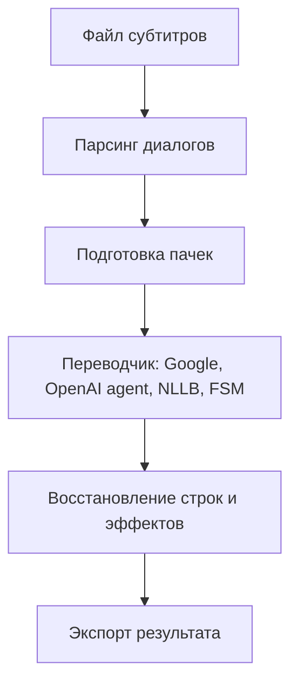

# sub-translator-py

Консольный переводчик субтитров (ASS/SRT/VTT) с сохранением таймингов, эффектов и структуры диалогов.
По умолчанию используется Google Translate; перевод через агент OpenAI подключается опционально.

**[Основан на TypeScript UI-версии](https://github.com/SanSan-/sub-translator)**

## Структура проекта

```
.
├─ sub_translate
│  ├─ cli.py                         # CLI и разбор аргументов
│  ├─ service.py                     # пайплайн перевода и сборки результата
│  ├─ translators
│  │  ├─ google_web.py               # перевод через Google Web RPC
│  │  ├─ agent.py                    # перевод через OpenAI agent
│  │  ├─ agent_prompts.py            # шаблоны подсказок для агента
│  │  ├─ local_utils.py              # общая логика локальных моделей
│  │  ├─ nllb.py                     # локальный переводчик NLLB
│  │  ├─ seamless.py                 # локальный переводчик SeamlessM4T
│  │  ├─ madlad.py                   # локальный переводчик MADLAD
│  │  └─ fsm.py                      # локальный переводчик FSMT
│  ├─ utils
│  │  ├─ line_utils.py               # разбор/очистка/сборка строк субтитров
│  │  ├─ validation_utils.py         # валидаторы форматов и регэкспы
│  │  ├─ translation_utils.py        # постобработка переводов
│  │  ├─ usage_tracker.py            # учёт токенов и стоимости
│  │  ├─ logging_utils.py            # конфигурация логирования
│  │  ├─ env_utils.py                # загрузка переменных окружения
│  │  ├─ huggingface.py              # загрузка и fallback HuggingFace-моделей
│  │  ├─ path_utils.py               # утилиты разбора языкового суффикса
│  │  └─ subtitle_cache.py           # кеш готовых переводов по имени файла
│  ├─ web
│  │  ├─ app.py                     # веб-приложение FastAPI
│  │  ├─ __main__.py                 # запуск UI
│  │  └─ static
│  │     ├─ index.html               # UI разметка
│  │     ├─ styles.css               # UI стили
│  │     └─ app.js                   # UI логика
│  └─ dictionaries
│     ├─ regex.py                    # регулярные выражения форматов
│     ├─ languages.py                # языки Google Translate
│     ├─ filters.py                  # фильтры для восстановления строк
│     └─ bad_symbols.py              # предобработка символов
├─ resources
│  ├─ cache                          # кеши перевода/промптов/статистики
│  └─ persist                        # долговременные данные (например, тарификация)
├─ logs                              # логи работы CLI и переводчиков
├─ tests                             # тесты и фикстуры
├─ .env                              # переменные окружения (локально)
├─ pyproject.toml                    # метаданные сборки и версия пакета
├─ requirements.txt                  # зависимости
└─ CHANGELOG.md                      # журнал изменений
```

## Ключевые возможности

- Поддержка форматов `ASS`, `SRT`, `VTT`.
- Веб-интерфейс с выбором файлов/папок, прогрессом по каждому файлу и журналом перевода.
- Умное объединение реплик (smart split) для снижения количества запросов.
- Восстановление разметки и эффектов после перевода.
- Перевод пачками и параллельность для Google (agent/nllb/fsm всегда однопоточные).
- Локальные модели NLLB, SeamlessM4T, MADLAD и FSMT для перевода без внешних API.
- Логи, кеши и учёт токенов/стоимости для агентного переводчика.

## Консольный запуск

Полный вызов со всеми флагами:

```bash
python -m sub_translate \
  --input path\to\input.ass \
  --output path\to\output.ass \
  --format ass \
  --from auto \
  --to ru \
  --api google \
  --batch-size 7 \
  --threads 3 \
  --allow-cpu-fallback \
  --smart-split \
  --tld com \
  --timeout 30 \
  --agent-system-prompt-file path\to\system_prompt.txt \
  --agent-prompt-file path\to\agent_prompt.txt \
  --verbose
```

Ключевые флаги:

- `--input` - путь к входному файлу (обязателен).
- `--output` - путь к выходному файлу (по умолчанию: `<input>.<api>.<to>.<ext>`).
- `--format` - формат субтитров: `ass|srt|vtt` (по умолчанию берётся из расширения).
- `--from` - язык источника (по умолчанию `auto`).
- Суффикс языка в имени (`sub.en.vtt`) имеет приоритет над `--from`; при формировании имени результата он заменяется на код `<to>`.
- `--to` - язык перевода (по умолчанию `ru`).
- `--api` - переводчик: `google|agent|nllb|nllb-lite|seamless|madlad|fsm`.
- `--batch-size` - размер пачки (по умолчанию `7`).
- `--threads` - число параллельных запросов (по умолчанию `3`, для локальных моделей фиксируется `1`).
- `--allow-cpu-fallback` - разрешить переход на CPU при ошибках загрузки локальных моделей.
- `--smart-split` - включить умное объединение реплик.
- `--tld` - домен Google Translate (по умолчанию `com`).
- `--timeout` - таймаут запроса в секундах (по умолчанию `30`).
- `--agent-system-prompt-file` - файл системного промпта агента (UTF-8).
- `--agent-prompt-file` - файл пользовательского промпта агента (UTF-8, нужен `{source}`).
- `--verbose` - подробный вывод в консоль и логи.

Примеры:

```bash
# ASS -> RU через Google (по умолчанию)
python -m sub_translate --input subs.ass --to ru

# SRT -> EN через Google с 4 потоками
python -m sub_translate --input subs.srt --to en --threads 4 --batch-size 20

# VTT -> RU через агента
python -m sub_translate --input subs.vtt --api agent --to ru --verbose

# ASS -> RU через NLLB (локальная модель)
python -m sub_translate --input subs.ass --api nllb --from en --to ru

# ASS -> RU через FSM (legacy-модель)
python -m sub_translate --input subs.ass --api fsm --from en --to ru
```


## Веб-интерфейс

Запуск:

```bash
python -m sub_translate.web
```

Откройте http://127.0.0.1:7860. Выбор файлов/папок выполняется через системные диалоги, результат пишется рядом с исходником. Настройки сохраняются в localStorage и переживают перезагрузку страницы.

Схема интерфейса:

```
+----------------------------------------------------------------------------------+
| Topbar: бренд | выбор файла/папки [Файл] [Папка] | Выгрузить | Перевести          |
+----------------------------------------------------------------------------------+
| Файлы (список, статус, прогресс)            | Настройки перевода                  |
+----------------------------------------------------------------------------------+
| Консоль (логи, кнопка "Очистить")                                             |
+----------------------------------------------------------------------------------+
```

## Переводчики

### Google (по умолчанию)

- Работает без ключей, использует web RPC.
- Поддерживает параллельные пачки (`--threads`).
- Управление доменом через `--tld`.

### Агент OpenAI

- Требует `OPENAI_API_KEY` (можно хранить в `.env`).
- Модель по умолчанию: `gpt-5.1-mini` (переменная `TRANSLATOR_AGENT_MODEL`).
- Параллельность настраивается через `--threads`.
- Промпты можно переопределять через `--agent-system-prompt-file` и `--agent-prompt-file`.
- В UI можно задать модель и ключ без изменения файлов.

Пример файлов промптов (по умолчанию):

`system_prompt.txt`:
```text
Ты - профессиональный переводчик субтитров и разнопрофильных текстов на русский язык.
Вход - обычный текст без разметки и кода. Перевод должен быть точным, естественным и без добавлений.

Правила:
1. Формат
   * Сохраняй количество строк и переносы строк точно как во входе.
   * Не объединяй и не дели строки, не меняй их порядок.
2. Имена и собственные
   * Имена персонажей переводить на русский, минимум транслитерацией.
   * Если имя уже русифицировано - оставляй как есть.
3. Термины и факты
   * Переводи термины по смыслу, без упрощений; сохраняй точность фактов.
   * Если фраза неполная или обрывочная, не додумывай продолжение.
4. Числа и символы
   * Сохраняй числа, даты, единицы и пунктуацию; не меняй формат.
5. Стиль
   * Сохраняй стиль исходника (разговорный, академический, деловой и т.д.).
   * Не добавляй пояснения и не цензурируй лексику.

Вывод: только переведённый текст без обёрток и комментариев.
```

`agent_prompt.txt`:
```text
Переведи текст на русский. Сохрани количество строк и переносы строк.

Верни только перевод, без тегов.

Формат:
<SOURCE>
{source}
</SOURCE>
```

### NLLB (локальная модель)

- Модель по умолчанию: `facebook/nllb-200-3.3B`, доступна через `--api nllb`.
- При наличии GPU и `bitsandbytes` включается 8-битная квантовка.
- `--from/--to`: алиасы `en`/`ru` или NLLB-коды (например, `eng_Latn`, `rus_Cyrl`).
- `auto` трактуется как `en`, перевод выполняется последовательно (один поток).

### NLLB Lite (локальная модель)

- Модель: `facebook/nllb-200-distilled-1.3B`, доступна через `--api nllb-lite`.
- Поддерживает те же языковые коды, что и NLLB.
- Перевод выполняется последовательно (один поток).

### SeamlessM4T v2 (Large)

- Модель: `facebook/seamless-m4t-v2-large`, доступна через `--api seamless`.
- `--from/--to`: коды ISO-639-3 (например, `eng`, `rus`), алиасы `en`/`ru` поддерживаются.
- `auto` трактуется как `eng`, перевод выполняется последовательно (один поток).

### MADLAD-400

- Модель: `google/madlad400-7b-mt`, доступна через `--api madlad`.
- `--from/--to`: коды ISO-639-3 (например, `eng`, `rus`), алиасы `en`/`ru` поддерживаются.
- `auto` трактуется как `eng`, перевод выполняется последовательно (один поток).

### FSMT (legacy-модель)

- Модель: `facebook/wmt19-en-ru`, веса лежат в `models/`.
- Поддерживает только `en -> ru`, `auto` трактуется как `en`.
- Перевод выполняется последовательно (один поток).

## Процессы по модулям

### sub_translate/cli.py

- Принимает параметры CLI, выбирает формат и переводчик.
- Формирует путь вывода, если он не указан.
- Инициализирует логгер и запускает основной пайплайн.

### sub_translate/service.py

- Читает файл, определяет формат и парсит диалоги.
- Готовит батчи для перевода, выполняет их и собирает результат.
- Восстанавливает структуру и экспортирует в исходный формат.

### sub_translate/utils/line_utils.py

- Очищает строки субтитров от эффектов/комментариев.
- Разбирает ASS/SRT/VTT диалоги.
- Строит пайплайн `prepare -> analyse -> restore` для корректной сборки строк.

### sub_translate/translators/google_web.py

- Использует web RPC Google Translate (без сторонних API-ключей).
- Умеет отправлять пачки строк и восстанавливать исходную структуру.

### sub_translate/translators/agent.py

- Перевод через OpenAI Responses API.
- Кеширует переводы и метаданные подсказок.
- Ведёт учёт токенов и стоимости.

## Пайплайн перевода

1. Чтение файла и разбор по строкам.
2. Парсинг диалогов (ASS/SRT/VTT).
3. Подготовка пачек для перевода (с учётом smart split).
4. Перевод пачек выбранным движком.
5. Восстановление структуры строк и экспорт результата.

## Диаграммы

### Поток обработки субтитров



## Переменные окружения (.env)

Файл `.env` лежит в корне проекта и уже добавлен для локального запуска.

Переменные:

- `OPENAI_API_KEY` - ключ доступа для OpenAI (обязателен при `--api agent`).
- `OPENAI_MODEL` - не используется текущим CLI, оставлен для совместимости.
- `TRANSLATOR_AGENT_MODEL` - модель агента (по умолчанию `gpt-5.1-mini`).
- `TRANSLATOR_WORKERS` - не используется текущим CLI, оставлен для совместимости.
- `HF_HOME` - базовый каталог кеша HuggingFace.
- `HUGGINGFACE_HUB_CACHE` - кеш моделей HuggingFace Hub.
- `TEMP`/`TMP` - каталог временных файлов для загрузки и распаковки.
- `HF_HUB_DISABLE_SYMLINKS_WARNING` - отключает предупреждение о symlink в кеше.

Пример содержимого (без ключей):

```env
OPENAI_API_KEY=<ваш_ключ>
OPENAI_MODEL=gpt-5.2
TRANSLATOR_AGENT_MODEL=gpt-5-mini
TRANSLATOR_WORKERS=3
HF_HOME=D:\sub-translator-py\models\hf
HUGGINGFACE_HUB_CACHE=D:\sub-translator-py\models\hf\hub
TEMP=D:\Temp
TMP=D:\Temp
HF_HUB_DISABLE_SYMLINKS_WARNING=1
```

## Форматы и кодировки

- ASS: используется секция `Dialogue:`.
- SRT: индекс + таймкоды `-->`.
- VTT: требуется заголовок `WEBVTT`.
- Вход читается как UTF-8; BOM удаляется.
- Выход записывается в UTF-8 без BOM.

## Кеши и логи

Кеши:

- `resources/cache/agent_translation_cache.json` - переводы агента.
- `resources/cache/agent_prompt_cache.json` - метаданные подсказок.
- `resources/cache/subtitle_translation_cache.json` - кеш готовых файлов перевода по связке `<input>.<api>.<to>`.
- `resources/cache/usage_stats.json` - статистика токенов и стоимости.
- `resources/persist/model_pricing.json` - тарифы моделей (опционально).

Логи:

- `logs/sub_translate.log` - основной лог CLI.
- `logs/translators/agent_translator.log` - лог агента.

## Требования и установка

- Python 3.14.
- Установка зависимостей:
  ```bash
  python -m pip install -r requirements.txt
  ```

## Тесты

```bash
python -m pytest
```

## Дневник изменений

См. `CHANGELOG.md`.
