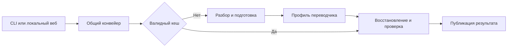

# Архитектура

1. CLI и веб используют `sub_translate/service.py` и `ProcessingSettings`; форматные правила не дублируются в оболочках.
2. Форматный разбор/восстановление отделены от `Translator`; адаптер возвращает ту же мощность.
3. Реестр описывает профили; один локальный слот владеет переключением, переводом и выгрузкой.
4. Несовместимый тяжёлый стек живёт в отдельном процессе; отказ не меняет поставщика или устройство скрытно.
5. Проверка результата предшествует атомарной публикации; повторно проверяемая идентичность защищает кеш.

Компоненты: [service.py](../../sub_translate/service.py), [реестр](../../sub_translate/translators/registry.py), [локальный слот](../../sub_translate/translators/lifecycle.py), [загрузчик](../../sub_translate/utils/huggingface.py).
Причины — [ADR](ADR/README.md).
