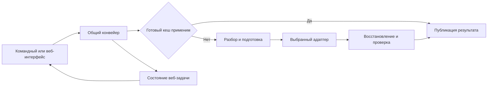

# Архитектура

Описание компонентов, ответственности и потоков. Проверяемые условия находятся в
[предметных спецификациях](../specs/README.md), причины выбора — в [ADR](ADR/README.md).

| Компонент | Ответственность |
|-----------|-----------------|
| Командный и локальный веб-интерфейсы | Получить явный выбор оператора и представить результат |
| Общий прикладной конвейер | Проверить вход и применимость кеша, связать подготовку, перевод, восстановление и публикацию |
| Обработка формата | Сохранить структуру и соответствие реплик, проверить готовый результат |
| Реестр и адаптеры | Описать совместимость профиля и выполнить выбранный перевод |
| Владелец локальной модели | Управлять ресурсами и изолированными процессами, безопасно переключать профиль |
| Состояние веб-задачи | Хранить авторитетный результат и обеспечить восстановление представления после разрыва связи |

## Схема общего конвейера

```mermaid
flowchart LR
    I[Командный или веб-интерфейс] --> S[Общий конвейер]
    S --> C{Готовый кеш применим}
    C -->|Нет| F[Разбор и подготовка]
    F --> T[Выбранный адаптер]
    T --> V[Восстановление и проверка]
    C -->|Да| O[Публикация результата]
    V --> O
    W[Состояние веб-задачи] --> I
    S --> W
```

Существенные инварианты: исходник отделён от результата; каждому входному элементу соответствует выход;
непроверенный результат не публикуется; локальный ресурс имеет одного владельца; отказ не меняет поставщика
скрытно; доставленное событие не заменяет состояние задачи. Вспомогательная статистика не отменяет успешный перевод.
